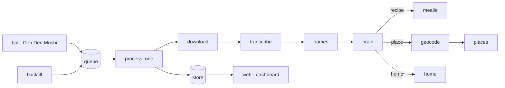

# Architecture

Grand Log is a small, flat Python package. One reel goes in, a structured item comes out, it lands in a best-of-breed destination, and it is indexed for search and resurfacing. Every module is single-purpose and under about 180 lines. The app lives in [`reel-pipeline/pipeline/`](reel-pipeline/pipeline).

## The flow
1. Share a reel (the bot) or load an Instagram export (backfill).
2. `process_one(url, bucket)` takes over.
3. download, then transcribe, then optionally sample frames.
4. the brain extracts a structured item (from the caption and transcript, plus the on-screen frames when a value is missing).
5. the item lands in its destination: Mealie for recipes, a map file for places, a vault file for home.
6. the store indexes it, so `/search`, `/digest`, and the dashboard can find it.

## Modules by layer

**Entrypoints (the runnable things)**
- `process.py` orchestrate one reel; dispatch by bucket
- `bot.py` the Telegram bot (Den Den Mushi): capture, cards, `/search`, `/digest`, `/dashboard`
- `web.py` the tile dashboard server
- `backfill.py` load an Instagram export into the queue
- `doctor.py` preflight check (`python -m pipeline.doctor`)

**Core**
- `config.py` env config (12-factor)
- `routing.py` bucket keys, crew names, and Collection-name routing (overridable via `routes.json`)
- `schema.py` the extraction schemas and prompts (recipe, place, home)
- `security.py` bot access control and the download host allow-list (SSRF guard)

**Stages (shared capture)**
- `download.py` yt-dlp, with a gallery-dl fallback
- `transcribe.py` whisper (faster-whisper or whisper.cpp)
- `frames.py` ffmpeg scene-frames and a thumbnail

**Extract (the brain)**
- `brain.py` provider-agnostic LLM adapters (Gemini, OpenAI-compatible, Anthropic), text and vision, with a validate-and-repair loop
- `geocode.py` free OpenStreetMap geocoding

**Destinations (per-bucket sinks)**
- `mealie.py` recipes to a Mealie cookbook
- `places.py` places to GeoJSON and CSV (My Maps, a sheet)
- `home.py` home items to CSV and JSON (a sheet, Notion)
- `recipes.py` recipes to a local cookbook file (JSON and CSV) when there is no Mealie

**Data**
- `queue.py` the resumable SQLite job queue
- `store.py` the saved-items index (search, recent, sample, get)

## Design principles
- Swappable adapters. The brain and the transcriber are chosen by one env var; a new vendor sits behind the same small interface.
- One front door, best-of-breed sinks. Capture is unified; recipes, places, and home each land in the right tool. The store is the index over all of them.
- Plain generic keys (`recipe`, `place`, `home`); the crew names (Baratie, Log Pose, Going Merry) are the brand layer.

## Where to add things
- A new brain or transcriber: a function in `brain.py` or `transcribe.py`, switched by env.
- A new destination: a module like `places.py`, plus a branch in `process.py`.
- A new bucket: add it to `routing.NAMES` and a `_process_*` in `process.py`.

## Why the package is flat
At 21 modules, each small and clearly named, a flat package stays navigable and avoids import ceremony. We group into subpackages (`destinations/`, `stages/`, and so on) only when one layer passes about five or six modules. None is close yet.

## Tests
`reel-pipeline/tests` mirrors the modules. The network and model stages are monkeypatched, so the suite runs fast with no external services. CI runs compile, ruff, and pytest on every push.
