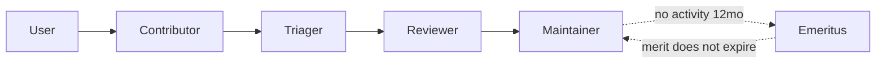

# Governance

Grand Log is young, with a clear ambition: grow a real crew that sails itself. We borrow the mechanics that scale (Kubernetes-style `OWNERS`, Node.js-style no-objection windows, Apache-style "merit does not expire") at thresholds a small project can actually hit.

## Principles
- Anyone contributes via fork and pull request. Nobody pushes to `main` directly.
- We do not score merit, which is subjective. We score the gate: named sponsors, time in grade, a no-objection window.
- Every promotion is a reviewable PR against `MAINTAINERS.md` or `OWNERS`.

## The ladder

| Rung | Can do | Promotion rule (measurable) | Approved by | Recorded as |
|---|---|---|---|---|
| **User** | Open issues, join Discussions | none | none | none |
| **Contributor** | Credited in the README | 1 or more merged PRs (code, docs, tests, or triage) | Automatic | contributors list |
| **Triager** | Label and triage issues, apply `good first issue`, close dupes | Active 1 month or more, plus 10 or more issues or PRs triaged | 1 Maintainer, no objection in 7 days | `TRIAGERS` in MAINTAINERS.md (a PR) |
| **Reviewer** | Review and approve PRs (auto-requested via CODEOWNERS) | Contributor 3 months or more, primary reviewer on 5 or more PRs, 15 or more merged PRs or reviews | 1 Maintainer sponsors, no objection from any Maintainer in 7 days | `reviewers:` in OWNERS (a PR) |
| **Maintainer** | Merge and release rights, governance vote | Reviewer 3 months or more, primary reviewer on 10 or more PRs, 25 or more merged PRs or reviews | 2 Maintainers (1 nominates, 1 sponsors), no objection in 14 days | `approvers:` in OWNERS (a PR) |

Thresholds are scaled-down Kubernetes numbers. We keep the ratios and the time in grade, and raise the counts as the crew grows.

> How it works on GitHub today: a promotion is a PR adding you to `MAINTAINERS.md`, [`OWNERS`](OWNERS), or `.github/CODEOWNERS`, approved per the rule above. Branch protection then auto-requests your review on matching paths. The Kubernetes-style `/lgtm` bot automation is a later step, and the ladder works fine on plain GitHub without it.

## Decisions
- Small changes: a Maintainer reviews and merges.
- Direction or larger changes: open an issue or Discussion first, with a 10-day comment window for proposals.
- Lazy consensus: silence means assent. A Maintainer "-1" with a stated reason blocks until it is resolved (Apache-style veto).

## Merit does not expire
No contributions in 12 months moves you to `EMERITUS` in MAINTAINERS.md, not out. Coming back is easy.

## Recognition (automated)
contrib.rocks avatars in the README, a credit in every release, GitHub achievements, and a `FUNDING.yml` Sponsor button. We may add the all-contributors bot for non-code recognition as we grow.

## Why a CLA plus dual license
So Grand Log stays free and open forever for the community while a commercial license funds the work. See [LICENSING.md](LICENSING.md).
