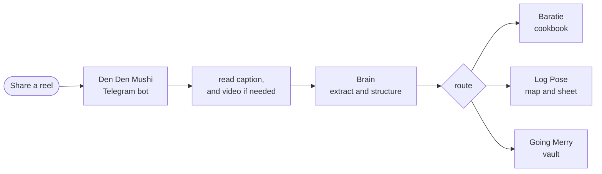

<div align="center">

# Grand Log

### Turn the Instagram reels you save and forget into a cookbook, a map, and a vault.

Share a reel to a Telegram bot. A small crew pulls out the value and files it where you will use it: a recipe you can cook, a place on your map, an idea in your vault. Self-hosted, free, and runs on any OS, triggered from any phone.


[](CHANGELOG.md)

[](https://github.com/naari21694/grand-log/actions/workflows/ci.yml)

[](CODE_OF_CONDUCT.md)

**[Install](docs/INSTALL.md)  ·  [Configure](docs/CONFIGURATION.md)  ·  [Deploy](docs/DEPLOY.md)  ·  [Troubleshooting](docs/TROUBLESHOOTING.md)  ·  [Architecture](ARCHITECTURE.md)  ·  [Security](SECURITY.md)  ·  [Ideas](IDEAS.md)  ·  [Changelog](CHANGELOG.md)  ·  [Contribute](CONTRIBUTING.md)**

</div>

---

## The problem

You save hundreds of reels: a recipe you meant to cook, a restaurant you meant to try, a shelf you meant to build. They sit in a folder you never reopen. Saving is easy. The hard part, pulling the value out and filing it somewhere you will actually reach for, is the part nobody does. Grand Log is that missing step.

## How it works



One share, zero typing. The phone never does the heavy work. Everything runs on your own box, with your own keys, and nothing phones home.

## What you get back

A reel whose caption reads:

> One-pan garlic butter pasta: 200g spaghetti, 4 cloves garlic, 50g butter, parmesan, serves 2.

becomes a structured recipe you can cook, scale, and search:

```json
{
  "title": "One-Pan Garlic Butter Pasta",
  "base_servings": 2,
  "ingredients": [
    {"quantity": 200, "unit": "g", "food": "spaghetti", "grams": 200},
    {"quantity": 4, "unit": "clove", "food": "garlic"},
    {"quantity": 50, "unit": "g", "food": "butter", "grams": 50},
    {"quantity": 0, "unit": "", "food": "parmesan", "note": "to taste"}
  ],
  "tags": ["pasta", "vegetarian", "quick"],
  "confidence": "high"
}
```

A place becomes a map pin with a name, area, and one line on why it is worth it. A home idea becomes a vault row with the item, room, and source. Each record lands in its destination (Mealie, your map, your vault) and is indexed so `/search` and the weekly digest can resurface it later.

## The crew

| | Tool | What it does | Status |
|---|---|---|---|
| 🍳 | **Baratie** | Recipes into a Mealie cookbook (or a local cookbook file), with exact measurements auto-scaled for 1, 2, 4, 6, 10 people | built |
| 🗾 | **Log Pose** | Places into map pins (GeoJSON) plus a region-grouped sheet (CSV) | built |
| 🏠 | **Going Merry** | Home and build-together ideas into a vault (CSV and JSON) | built |
| 🐌 | **Den Den Mushi** | The Telegram bot you share reels to. Any phone, zero install, identical on iOS and Android | built |

Crew names are an affectionate One Piece homage. The bucket keys underneath are plain: `recipe`, `place`, `home`.

## What it supports right now

- **AI brains: any key you already have**, through three adapters. Gemini (free tier), any OpenAI-compatible API (OpenAI, OpenRouter, Groq, Together, DeepSeek, or local Ollama), and Anthropic. A validate-and-repair step keeps the output schema-valid even on a small free model.
- **Three capture modes** (`CAPTURE_MODE`): `auto` reads the caption first and only downloads the video and runs Whisper when the caption is thin; `caption` never downloads; `full` always does.
- **Full on-screen vision for every crew:** the vision pass reads all on-screen text (names, addresses, prices, dimensions, quantities, steps) for recipe, place, and home, not just recipe quantities.
- **GPU transcription that just works:** faster-whisper auto-detects an NVIDIA GPU and runs on CUDA (`WHISPER_DEVICE=auto`), with a free Groq cloud option (`TRANSCRIBE_BACKEND=groq`) and a CPU fallback. Force the device with `cpu` or `cuda`.
- **Destinations:** recipes to Mealie, or to a local cookbook file (`work/recipes.json` plus a CSV summary) when there is no Mealie; places to GeoJSON plus CSV for Google My Maps and a sheet; home items to CSV plus JSON for a sheet or Notion.
- **Multilingual** transcription (auto-detected: English, Japanese, Hindi, and more).
- **Guided setup:** `python -m pipeline.setup` prompts for your brain provider and key, writes `.env`, and runs the doctor.
- **A blip never loses a reel:** the worker retries a transient Instagram or network failure with exponential backoff and dead-letters only after `WORKER_MAX_ATTEMPTS`.
- **A local media archive:** `KEEP_MEDIA` (default on) keeps the downloaded video, frames, and thumbnail; set it false to delete them after extraction and save disk.
- **`cookies.txt` that works on Windows:** drop a Netscape `cookies.txt` (default `work/cookies.txt`) and it is auto-detected, taking precedence over browser cookies, which sidesteps the Windows browser-cookie failure.
- **Any OS** via Python or a Docker image you build, and **any phone** via the Telegram bot.
- **Source:** Instagram reels and posts today. The downloader (yt-dlp) and the host allow-list already cover TikTok and YouTube, not yet tested end to end.

## Baratie: a recipe engine, not a bookmark

- **Exact measurements** from the caption, the audio, and the on-screen text. The vision pass reads quantities that flash on screen and are never spoken.
- **Real scaling.** Ingredients land as structured `quantity + unit + food`, so Mealie's slider renders any serving count, and Baratie adds the part a slider cannot: the non-linear notes for salt, spice, leavening, cook time, and pan size when you change the batch.
- **Canonical grams plus dual units, per-serving nutrition, tags, and a confidence flag** on anything the reel left ambiguous.

## Quick start

```bash
cd reel-pipeline
python -m venv .venv
. .venv/bin/activate              # Windows (PowerShell): .\.venv\Scripts\Activate.ps1
pip install -r requirements.txt
python -m pipeline.setup          # guided: writes .env (add a free Gemini key), then runs the doctor
```

Then extract one reel from its caption alone (no download, no Whisper):

```bash
python -m pipeline.process "https://www.instagram.com/reel/XXXX/" --no-video --dry-run
```

`--no-video` reads only the caption; drop it to read the audio and on-screen text when the caption is thin. `--dry-run` writes to a local cookbook under `work/`; add `MEALIE_URL` and `MEALIE_TOKEN`, then drop `--dry-run`, to land recipes in Mealie. ffmpeg is only needed when a reel falls back to video ([download](https://ffmpeg.org/download.html); Windows: `winget install Gyan.FFmpeg`). Full walkthrough: [docs/INSTALL.md](docs/INSTALL.md). Every setting: [docs/CONFIGURATION.md](docs/CONFIGURATION.md).

## Requirements and where to get them

| Need | What it is | Where to get it | Required? |
|---|---|---|---|
| Python 3.10+ | the runtime | [python.org](https://www.python.org/downloads/) | yes |
| ffmpeg | audio and frame extraction | [ffmpeg.org](https://ffmpeg.org/download.html) (Windows: `winget install Gyan.FFmpeg`) | for `auto`/`full` mode; not for caption-only |
| An AI key | the brain | [Gemini](https://aistudio.google.com/) (free), or [OpenAI](https://platform.openai.com/), [OpenRouter](https://openrouter.ai/), [Groq](https://console.groq.com/), [Anthropic](https://console.anthropic.com/), or local [Ollama](https://ollama.com/) | yes, or run Ollama for none |
| Telegram bot token | the share front door | [@BotFather](https://t.me/BotFather) | for the bot; not for the CLI |
| Mealie | the recipe cookbook | [mealie-recipes/mealie](https://github.com/mealie-recipes/mealie) | optional; without it, recipes save to a local cookbook file |
| Cloudflare Tunnel | expose Mealie and the dashboard safely | [Cloudflare Zero Trust](https://developers.cloudflare.com/cloudflare-one/connections/connect-networks/) | optional |
| Instagram cookies | downloads behind the login wall | a throwaway account, exported `cookies.txt` | only if a download is blocked |

## Then it gets out of your way

Capture is one front door; what you save fans out to the tool built for it, and one hub indexes all of it.

- **A rich card the moment you share:** thumbnail, title, a one-line summary, and an Open button to the destination.
- **`/search`** across everything you ever saved.
- **`/digest`** resurfaces a few saves to revisit, because a save that never resurfaces is a save you lost.
- **A tile dashboard** of every save, in any phone browser or as a Telegram Mini App.

The design behind this is in [docs/research-oss-android-apps.md](docs/research-oss-android-apps.md).

## Yours, and only yours

- **No telemetry, no analytics, it never phones home.** See [PRIVACY.md](PRIVACY.md). You choose which AI provider sees your reels, or run Ollama so nothing leaves your machine.
- Everything runs on your infrastructure with your keys. Secrets live in a git-ignored `.env`.
- **Locked down by default:** the bot answers only your own Telegram chat, only known video hosts are downloaded (SSRF guard), and the dashboard binds to localhost. Run `python -m pipeline.doctor` to confirm. Full checklist in [SECURITY.md](SECURITY.md).
- Supply-chain workflows: CodeQL scanning, OpenSSF Scorecard, and Dependabot.

## Honest positioning

Grand Log is not the first to turn a reel into a recipe, a save into a map pin, or a post into an AI vault. Those exist, as SaaS (ReciMe, Triply, Preplo) and as open source, the closest being [`pickeld/social_recipes`](https://github.com/pickeld/social_recipes), [`Peter-SB/n8n-ai-instagram-scraper`](https://github.com/Peter-SB/n8n-ai-instagram-scraper), and [Karakeep](https://github.com/karakeep-app/karakeep). What we have not found elsewhere: one self-hosted pipeline, on your own AI credits, fanning out to purpose-built destinations, with disciplined recipe scaling and resurfacing, plus a backfill that re-files your whole Instagram history using your saved Collection names as the router.

## Status and ideas

What is built is in the table above and in the [CHANGELOG](CHANGELOG.md). What we are thinking about next (caption-first onboarding wins, a prebuilt image, auto-router, resurfacing reminders, more platforms, new buckets) lives in [IDEAS.md](IDEAS.md), kept separate so this README stays a map, not a list of promises.

## Credits

Grand Log is assembly, not invention. It stands on these projects, each invoked as a separate tool, never bundled or modified:

- **Download:** [yt-dlp](https://github.com/yt-dlp/yt-dlp) (Unlicense), [gallery-dl](https://github.com/mikf/gallery-dl) (GPL-2.0)
- **Media and audio:** [FFmpeg](https://ffmpeg.org) (LGPL/GPL), [faster-whisper](https://github.com/SYSTRAN/faster-whisper) (MIT), [whisper.cpp](https://github.com/ggml-org/whisper.cpp) (MIT), [OpenAI Whisper](https://github.com/openai/whisper) (MIT)
- **Bot and runtime:** [python-telegram-bot](https://github.com/python-telegram-bot/python-telegram-bot) (LGPL-3.0), [requests](https://github.com/psf/requests) (Apache-2.0), [python-dotenv](https://github.com/theskumar/python-dotenv) (BSD-3), [anthropic SDK](https://github.com/anthropics/anthropic-sdk-python) (MIT)
- **Destinations:** [Mealie](https://github.com/mealie-recipes/mealie) (AGPL-3.0), [Tandoor](https://github.com/TandoorRecipes/recipes) (AGPL-3.0)
- **AI providers:** Google Gemini, OpenAI, Anthropic, and OpenAI-compatible hosts (OpenRouter, Groq, Together) and local Ollama, used with your own keys.
- **Geocoding:** [OpenStreetMap Nominatim](https://nominatim.org/).
- **README visuals:** [capsule-render](https://github.com/kyechan99/capsule-render), [contrib.rocks](https://contrib.rocks), [star-history](https://star-history.com).

Prior art that shaped the honest positioning is credited above. The crew names are a fan homage to One Piece (© Oda, Shueisha, Toei), used as codenames, not trademark claims.

## Contributing

Anyone can contribute by fork and pull request. Trusted contributors climb a transparent, rules-based ladder (Contributor, Triager, Reviewer, Maintainer). Start with [ARCHITECTURE.md](ARCHITECTURE.md), then [CONTRIBUTING.md](CONTRIBUTING.md) and [GOVERNANCE.md](GOVERNANCE.md). Be kind: [Code of Conduct](CODE_OF_CONDUCT.md).

## License

Open source under [AGPL-3.0](LICENSE): free to use, modify, self-host, and build on, as long as your version stays open too. A commercial or closed-source product on top needs a separate commercial license, see [LICENSING.md](LICENSING.md).

