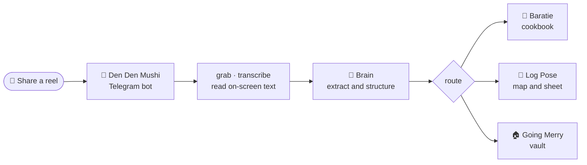

<div align="center">


[](https://github.com/naari21694/grand-log)

```text
                 .-~~~~~~~~~-.
               .'             '.
              /                 \
          .--'==================='--.
         /                           \
         '._________________________.'
```

<sub>👒 the mugiwara mark, full yellow on a real terminal</sub>

### Turn the reels you save and forget into a cookbook, a map, and a vault.

**Share a reel to a Telegram bot. A small crew pulls out the value and files it where you will actually use it.** Self-hosted. Free. Runs on any OS. Triggered from any phone.


[](CHANGELOG.md)


[](CODE_OF_CONDUCT.md)

<br>


</div>

---

## ☠️ You are sitting on a graveyard of saved reels

A recipe you swore you would cook. A restaurant you swore you would try. A shelf you swore you would build. They are all in a folder you will never open again. Saving felt like doing something. It was not. More than 80% of saved posts are never opened twice. The hard part was never the saving. It was pulling the value out and putting it somewhere you would actually reach for it. Nobody does that part.

**Grand Log is the crew that does it for you.**

Share a reel. Grand Log watches the video, reads the caption, listens to the audio, and reads the text on the screen. Then it files the treasure where it belongs: a recipe you can cook tonight, a pin on your map, an idea in your vault. The folder you forgot becomes a tool you use.

## 🧭 How it works



One share. Zero typing. The phone never does the heavy work. Everything runs on your own box, with your own keys, and nothing ever phones home.

## 🐉 Meet the crew

| | Tool | What it does | Status |
|---|---|---|---|
| 🍳 | **Baratie** | Recipes into a Mealie cookbook with exact measurements, auto-scaled for 1, 2, 4, 6, 10 people | built |
| 🗾 | **Log Pose** | Places into map pins (GeoJSON) plus a region-grouped sheet (CSV) you import in two clicks | built |
| 🏠 | **Going Merry** | Home and build-together ideas into an organized vault (CSV and JSON) | built |
| 🐌 | **Den Den Mushi** | The Telegram bot you share reels to. Any phone, zero install, identical on iOS and Android | built |

Brand names are an affectionate One Piece homage. Under the hood the keys are plain: `recipe`, `place`, `home`.

<div align="center">

```text
            .  N  .
         NW  \ | /  NE
        W ----( + )---- E
         SW  / | \  SE
            '  S  '
```

<sub>🧭 Log Pose always points back to the treasure</sub>

</div>

## 🍳 Baratie: a recipe engine, not a bookmark

Most reel-to-recipe tools give you a wall of text. Baratie gives you a recipe you can cook.

- **Exact measurements** from the caption, the audio, and the on-screen text. The vision pass reads quantities that flash on screen and are never spoken.
- **Real scaling.** Ingredients land as structured `quantity + unit + food`, so Mealie's slider renders 1, 2, 4, 6, or 10 servings natively. Then Baratie adds the part a slider cannot: the non-linear notes for salt, spice, leavening, cook time, and pan size when you double a batch.
- **Canonical grams + dual units, per-serving nutrition, tags, and a confidence flag** on anything the reel left ambiguous.
- **Multilingual.** English, Japanese, Hindi, and more, transcribed and translated on the way in.
- **Swappable everything.** Brain, transcriber, and destination are each one line in `.env`.

## 🚀 Quick start

```bash
cd reel-pipeline
python -m venv .venv && . .venv/bin/activate      # Windows: .\.venv\Scripts\Activate.ps1
pip install -r requirements.txt                    # plus install ffmpeg
cp .env.example .env                               # add a free Gemini key from aistudio.google.com
python -m pipeline.process "https://www.instagram.com/reel/XXXX/" --dry-run
```

That writes `work/last_recipe.json`, the full structured recipe with measurements, grams, scaling notes, and per-serving nutrition. Add `MEALIE_URL` and `MEALIE_TOKEN`, drop `--dry-run`, and it lands in a real cookbook you can open on your phone.

> New here? Follow [docs/INSTALL.md](docs/INSTALL.md) step by step. Bring any AI key you already have: every provider (Gemini, OpenAI, OpenRouter, Groq, Ollama, Anthropic) and every setting is in [docs/CONFIGURATION.md](docs/CONFIGURATION.md). Cloud deploy in one click: [docs/DEPLOY.md](docs/DEPLOY.md).

<details>
<summary>📦 <b>Install on any OS, trigger from any phone, upgrade in one command</b></summary>

<br>

- **Any OS.** A multi-arch Docker image runs identically on Linux, macOS, Windows, and Raspberry Pi. The CLI image works today (`docker run grand-log "<reel>" --dry-run`). The one-command `docker compose up -d` service ships with Den Den Mushi.
- **Any phone.** The trigger is a Telegram bot. Nothing to install, identical on iOS, Android, and web. Your phone never runs the heavy work.
- **One-click cloud.** Deploy buttons for Railway, Render, and Fly are on the roadmap.
- **One-command upgrade.** `docker compose pull && docker compose up -d`, or automatic with Watchtower.

</details>

## 🗺️ Then it gets out of your way

Capture is one front door. What you saved fans out to the tool built for it, and a single hub indexes all of it.

- **A rich card the moment you share:** thumbnail, title, a one-line summary, and an Open button straight to the destination.
- **`/search`** across everything you ever saved, in one place.
- **`/digest`** resurfaces a few saves to revisit, because a save that never resurfaces is a save you lost. Resurfacing is the single most-requested fix in the whole save-for-later space, and it is built in from day one.
- **A tile dashboard** of every save, in any phone browser or as a Telegram Mini App.

This is the part the rest skip. Grand Log was designed around it on purpose. (See [docs/research-oss-android-apps.md](docs/research-oss-android-apps.md) for the user research that drove the design.)

## 🔐 Yours, and only yours

- **No telemetry. No analytics. It never phones home.** See [PRIVACY.md](PRIVACY.md).
- Everything runs on your infrastructure with your keys. Secrets live in a git-ignored `.env`, never in the repo.
- **Locked down by default.** The bot answers only your own Telegram chat, only known video hosts are ever downloaded (SSRF guard), and the dashboard binds to localhost. Run `python -m pipeline.doctor` to confirm. Full checklist in [SECURITY.md](SECURITY.md).
- **Supply-chain hardened:** CodeQL scanning, OpenSSF Scorecard, Dependabot, signed releases, least-privilege CI. See [SECURITY.md](SECURITY.md).

## 🧱 What it stands for

- **Free-first.** $0 wherever possible: free-tier cloud, free-tier AI, open source everywhere.
- **Lean.** If 10 lines do the job as well as 200, it is 10. The whole package is 20 small modules, each under about 180 lines, with 73 passing tests.
- **Swappable.** Every stage is an adapter. Change vendors with one env var.
- **Capture must end in action.** A recipe you cook, a pin you follow, a home you build. Never a prettier hoard.

## 🧭 Honest by default

Grand Log is not the first to turn a reel into a recipe, a save into a map pin, or a post into an AI vault. Those exist, as SaaS (ReciMe, Triply, Preplo) and as open source. The closest cousins: [`pickeld/social_recipes`](https://github.com/pickeld/social_recipes), [`Peter-SB/n8n-ai-instagram-scraper`](https://github.com/Peter-SB/n8n-ai-instagram-scraper), and [Karakeep](https://github.com/karakeep-app/karakeep).

What no one else assembles: one self-hosted pipeline, on your own AI credits, fanning out to purpose-built destinations, with disciplined recipe scaling and resurfacing built in, plus a backfill that re-files your entire Instagram history using your own saved Collection names as the router. That last trick we have not found anywhere else.

## 🙏 Standing on giants

All invoked as separate tools, never bundled or modified:
[yt-dlp](https://github.com/yt-dlp/yt-dlp) (Unlicense), [gallery-dl](https://github.com/mikf/gallery-dl) (GPL-2.0), [FFmpeg](https://ffmpeg.org) (LGPL/GPL), [faster-whisper](https://github.com/SYSTRAN/faster-whisper), [whisper.cpp](https://github.com/ggml-org/whisper.cpp), [OpenAI Whisper](https://github.com/openai/whisper) (MIT), [Mealie](https://github.com/mealie-recipes/mealie), [Tandoor](https://github.com/TandoorRecipes/recipes) (AGPL), [python-telegram-bot](https://github.com/python-telegram-bot/python-telegram-bot) (LGPL), Gemini, and Claude.

## 🗓️ Roadmap

- [x] **Baratie** core pipeline (single-reel, dry-run testable)
- [x] **Den Den Mushi**: Telegram bot, SQLite queue, worker, and Docker compose
- [x] Backlog backfill from your Instagram data export (saved Collections become routes)
- [x] **Log Pose** v1: places to a GeoJSON and region CSV for My Maps and a sheet
- [x] **Going Merry** v1: home ideas to a CSV and JSON vault for a sheet or Notion
- [x] **Hub**: rich capture cards, `/search` across everything, `/digest` resurfacing
- [x] **Dashboard**: a clean tile view of everything, in the browser or as a Telegram Mini App
- [ ] One-click cloud deploy, auto-router (one share, zero taps), resurfacing reminders, more platforms (TikTok, Shorts)

## 🤝 Join the crew

Grand Log wants a real crew. Anyone can contribute by fork and pull request. Trusted contributors climb a transparent, rules-based ladder (Contributor, Triager, Reviewer, Maintainer) with measurable promotion criteria. Start with [ARCHITECTURE.md](ARCHITECTURE.md) for the module map, then [GOVERNANCE.md](GOVERNANCE.md) and [CONTRIBUTING.md](CONTRIBUTING.md). Be kind: [Code of Conduct](CODE_OF_CONDUCT.md).

## 📜 License

Open source under [AGPL-3.0](LICENSE): free to use, modify, self-host, and build on, forever, as long as your version stays open too. Building a commercial or closed-source product on it needs a separate commercial license, see [LICENSING.md](LICENSING.md). Dual-licensing keeps Grand Log free and community-driven while ensuring anyone who profits from it gives back.

> "Grand Log" is the brand. The crew (Baratie, Log Pose, Den Den Mushi, Going Merry) are an affectionate fan homage to One Piece (© Oda, Shueisha, Toei). They are codenames, not trademark claims.

---

<div align="center">

### Contributors
<a href="https://github.com/naari21694/grand-log/graphs/contributors">
  
</a>

### Star history
[](https://star-history.com/#naari21694/grand-log&Date)

<br>

**Free to use. Free to build on. Open forever. Profit from it, give back.** 🏴‍☠️


</div>
